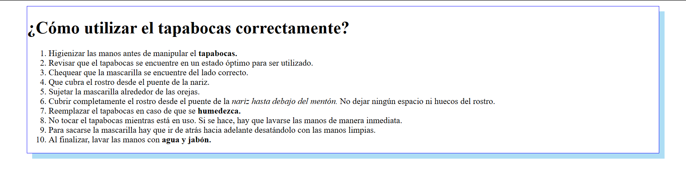

# La primera tarea:

* Utilizamos los siguientes elementos:
  - enunciados 
  - listas 
  - strong 
  - em.
* En el index.html, generamos una _lista ordenada_. 
Utilizamos el elemento _ol_.

 ## Con el siguiente texto:
>¿Cómo utilizar el tapabocas correctamente?
>1. Higienizar las manos antes de manipular el tapabocas.
>2. Revisar que el tapabocas se encuentre en un estado óptimo para ser utilizado.
>3. Chequear que la mascarilla se encuentre del lado correcto.
>4. Que cubra el rostro desde el puente de la nariz.
>5. Sujetar la mascarilla alrededor de las orejas.
>6. Cubrir completamente el rostro desde el puente de la nariz hasta debajo del mentón. 
No dejar ningún espacio ni huecos del rostro.
>7. Reemplazar el tapabocas en caso de que se humedezca.
>8. No tocar el tapabocas mientras está en uso. Si se hace, hay que lavarse las manos de manera inmediata.
>9. Para sacarse la mascarilla hay que ir de atrás hacia adelante desatándolo con las manos limpias.
>10. Al finalizar, lavar las manos con agua y jabón.

### Imagen (le agregue algo de css)

